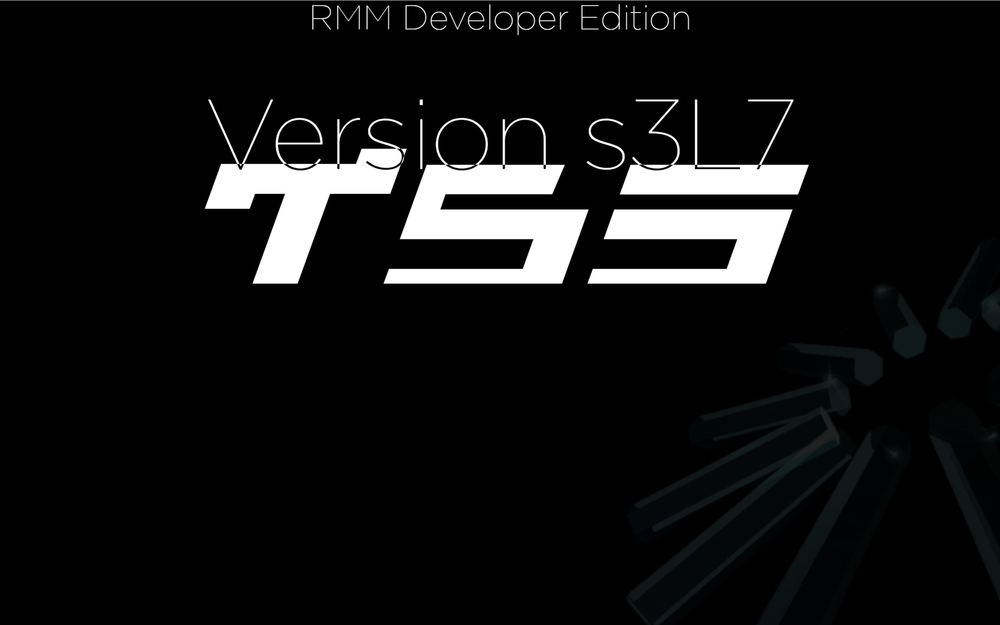

# 3dtest-tyson3d-myt5s-app



Full 3D open world environment featuring an animated 3D stickman and a drivable sports car.

## Features

- **Procedural 3D Stickman**:
  - Full body model with head, expressive eyes, torso, arms, and legs.
  - Procedural walk, sprint, jump, and idle breathing animations.
  - Dynamic contact shadow.
- **Drivable 3D Sports Car**:
  - Sporty red aerodynamic body, tinted glass cabin, and rear spoiler.
  - 4 detailed wheels that spin realistically; front wheels steer with turning angle.
  - Realistic arcade physics: acceleration, braking, reverse, and drifting with handbrake.
  - Dynamic engine sound synthesized via Web Audio API.
  - Vehicle entry and exit mechanics (`[E]` key).
- **3D Town Environment**:
  - Sky with atmospheric fog and directional sun casting real-time soft shadows.
  - Circular asphalt track with center road markings.
  - Low-poly pine and deciduous trees.
  - Modern multi-story colorful town buildings.
  - Stunt jump ramps for launching the car.
- **Dynamic Camera System**:
  - On Foot: Smooth orbital third-person follow camera (mouse drag to rotate).
  - In Car: High-speed dynamic chase camera with distance scaling and speedometer.

## Controls

### On Foot (Stickman)
- `W` / `A` / `S` / `D` or `Arrow Keys`: Walk and turn
- `Shift`: Sprint
- `Space`: Jump
- `E`: Enter Car (when standing near it)
- `Mouse Drag`: Orbit camera view

### In Car (Driving)
- `W` / `Up Arrow`: Accelerate
- `S` / `Down Arrow`: Brake / Reverse
- `A` / `D` or `Left` / `Right Arrow`: Steer
- `Space`: Handbrake / Drift
- `E`: Exit Car

## Development & Deployment

Run local server:
```bash
npm start
# or python3 -m http.server 8000
```

Build for Cloudflare Pages:
```bash
npm run build
```
Target directory: `./dist` (configured in `wrangler.jsonc`)
